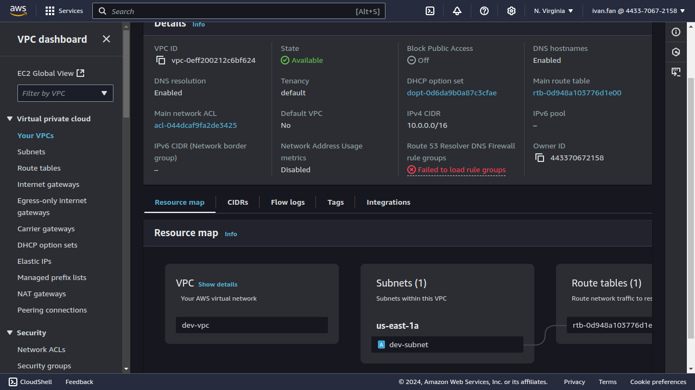
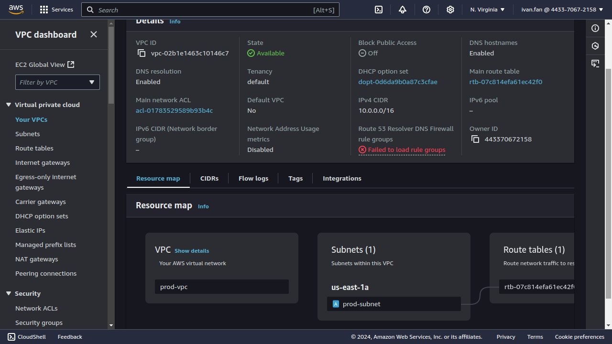
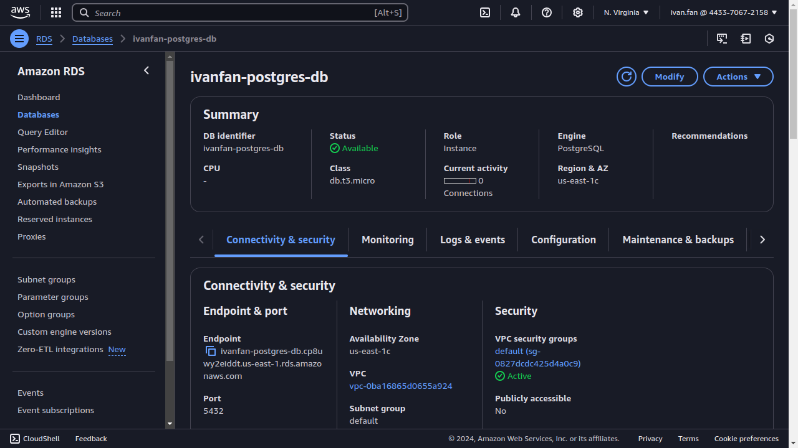
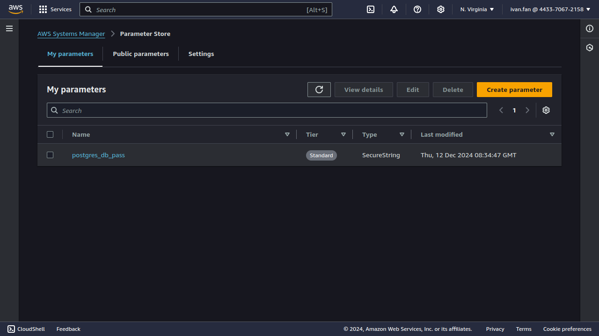
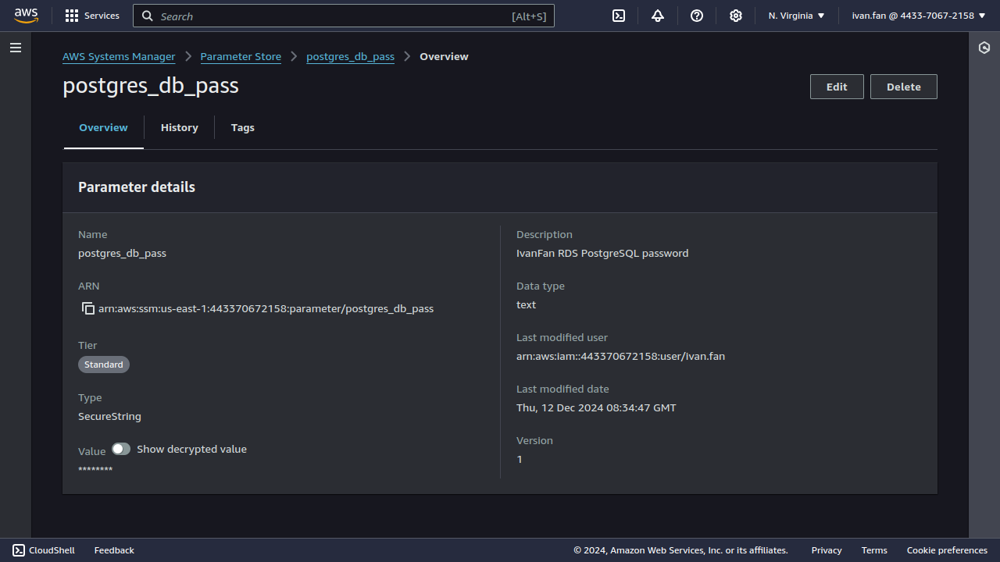

# IBA devops training 

## HW14. Terraform. Creating vpc using workspaces

```
sudo ./terraform workspace new prod
sudo ./terraform workspace new dev
sudo ./terraform workspace list
sudo ./terraform workspace select prod
sudo ./terraform init
sudo ./terraform plan
sudo ./terraform apply
sudo ./terraform destroy
sudo ./terraform workspace list
sudo ./terraform workspace select dev
sudo ./terraform apply
sudo ./terraform destroy
```


#### Screenshot






## Create rds with random pass saved in parameter store





